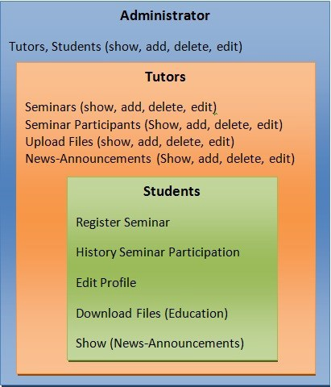

# EDSMS
E-DSMS is an electronic Dynamic Seminar Management System developed with an open-
source software philosophy. It seamlessly adapts to various educational environments and prioritizes user-
friendly operation. Students can easily register, enroll in seminars, access e-learning materials anytime, and
receive updates for their enrolled seminars. Administrators and tutors have user-friendly tools for managing
seminars and trainees, sending materials and announcements, recording attendance, and issuing certificates.
The system facilitates electronic organization, storage, and presentation of educational materials, transcending
the constraints of traditional teaching methods. Its main outcomes include the integration of new technologies,
leveraging network infrastructure, and maximizing the wealth of educational resources available.
https://github.com/EDSMS-SYSTEM/EDSMS/blob/main/images%20e-sem/Fig.%201a-Diagram%20of%20e-Sem%20system.jpg

